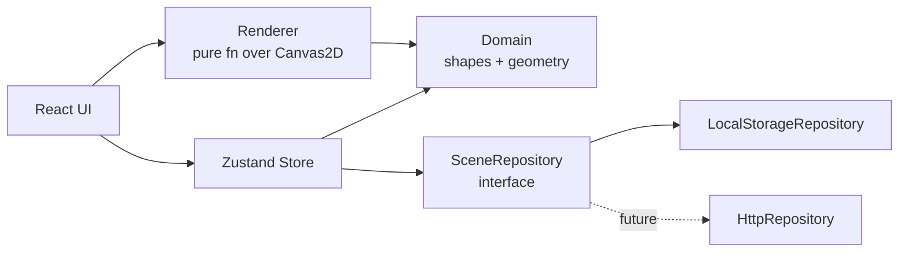

# Mini Excalidraw

A minimal browser-based Excalidraw-like graphic design tool, written in TypeScript with React + Zustand + Vite.

- **5 shapes**: rectangle, ellipse, diamond, line, arrow
- **Text** elements with editable content and font controls
- **Styling**: stroke + fill colour, stroke width, dash style, opacity, font family + size
- **Sessions**: name, save, load, list, delete; auto-save with debounce
- **Persistence**: browser `localStorage` today, swappable for any backend tomorrow
- **Tested**: 164 unit + integration tests (95.8% line coverage)

## Requirements

- Node.js `>=22` (use `nvm use` — see `.nvmrc`)
- Yarn (classic)

## Setup

```bash
yarn install
```

## Scripts

| Script               | Description                                          |
| -------------------- | ---------------------------------------------------- |
| `yarn dev`           | Start the Vite dev server at `http://localhost:5173` |
| `yarn build`         | Type-check + production build to `dist/`             |
| `yarn preview`       | Serve the built `dist/` to validate the build        |
| `yarn typecheck`     | Run `tsc --noEmit` (no output, just check)           |
| `yarn test`          | Run the full Vitest suite once                       |
| `yarn test:watch`    | Vitest in watch mode                                 |
| `yarn test:coverage` | Vitest with V8 coverage report                       |
| `yarn clean`         | Remove the `dist/` directory                         |

## Architecture

Strict, one-way layering. Each layer below is pure / framework-free except UI. This keeps the app testable and makes the persistence layer trivially swappable.



| Layer         | Path                | What lives here                                                                |
| ------------- | ------------------- | ------------------------------------------------------------------------------ |
| Domain        | `src/domain/`       | Element types, geometry (bbox + hit-test), style palettes/presets. Pure TS.    |
| Persistence   | `src/persistence/`  | `SceneRepository` interface, two implementations, autosave subscriber.         |
| State         | `src/state/`        | Zustand store: elements, selection, tool, currentStyle, session id, actions.  |
| Renderer      | `src/render/`       | Pure `render(ctx, scene)` over `CanvasRenderingContext2D`. Plus a test helper. |
| UI            | `src/ui/`           | React components: App, Canvas, Toolbar, StylePanel, SessionPanel, primitives. |

## Style presets

| Setting       | Values                                                                             |
| ------------- | ---------------------------------------------------------------------------------- |
| Stroke colour | charcoal, red, green, blue, orange, violet, pink, slate                            |
| Fill colour   | (above) + transparent (default)                                                    |
| Stroke width  | thin (1px), medium (2px), thick (4px)                                              |
| Stroke style  | solid, dashed (`[8,4]`), dotted (`[2,4]`)                                          |
| Opacity       | 25 / 50 / 75 / 100                                                                 |
| Font family   | sans, serif, mono                                                                  |
| Font size     | S (14px), M (20px), L (28px), XL (40px)                                            |

All exported from [src/domain/style.ts](src/domain/style.ts) as typed `as const` arrays/maps; adding a new entry is one line and the UI iterates automatically.

## Keyboard shortcuts

- `V` — Select tool
- `R` — Rectangle
- `O` — Ellipse
- `D` — Diamond
- `L` — Line
- `A` — Arrow
- `T` — Text
- `Delete` / `Backspace` — Remove the current selection
- `Esc` — Clear the current selection (also commits an in-progress text edit)

Shortcuts are ignored while the user is typing into an `<input>` or `<textarea>` (so renaming a scene won't switch tools).

## Swapping the backend

The persistence seam is a single TypeScript interface — see [src/persistence/repository.ts](src/persistence/repository.ts):

```ts
export interface SceneRepository {
  list(): Promise<SceneSummary[]>;
  load(id: string): Promise<Scene | null>;
  save(scene: Scene): Promise<void>;
  delete(id: string): Promise<void>;
}
```

To wire an HTTP backend, write an `HttpRepository implements SceneRepository` and inject it from [src/main.tsx](src/main.tsx):

```ts
const repository = new HttpRepository("https://api.example.com");
subscribeAutosave(useSceneStore, repository);
// …createRoot(...).render(<App repository={repository} />);
```

Nothing else in the codebase changes — the store, the components, the tests are all unaware of where bytes live. The persisted format is versioned (`schemaVersion: 1`) so future migrations slot in cleanly.

## Manual smoke test

After running `yarn dev` and opening `http://localhost:5173`, work through this checklist:

1. Pick the rectangle tool (`R`), drag from one point to another → a rectangle appears.
2. Pick ellipse (`O`), diamond (`D`), line (`L`), arrow (`A`), each in turn → drawing each works.
3. Pick text (`T`), click on the canvas, type, blur (or press `Enter`) → text element appears.
4. Click a shape with the select tool (`V`) → it shows a dashed selection outline; the style panel opens.
5. Change stroke colour, fill colour, stroke width, dash style, opacity → the selected element updates live.
6. With a text element selected (or the text tool active), font family and font size controls appear.
7. Rename the scene in the session panel → name updates; "Saved · just now" appears within ~1s.
8. Reload the page → the scene restores automatically (most-recent scene first).
9. Click "New" in the toolbar → a fresh blank scene; the previous one remains in the saved list.
10. Click an old scene's name in the session panel → it loads.
11. Click `×` next to a scene → it deletes from the panel + from `localStorage`.
12. Press `Delete` with an element selected → it disappears.
13. Press `Esc` with an element selected → selection clears.

## Tests

```bash
yarn test            # one-shot
yarn test:watch      # watch mode
yarn test:coverage   # html report at coverage/index.html
```

Tests live alongside source files as `*.test.ts` / `*.test.tsx`. The renderer is tested without a real canvas by passing a recording stub of `CanvasRenderingContext2D` — see [src/render/recordingContext.ts](src/render/recordingContext.ts). UI tests run in jsdom; `src/test/setup.ts` polyfills `PointerEvent` and `setPointerCapture` so React's pointer-event handlers fire from `fireEvent.pointerDown(...)`.

## Project layout

```
.
├── index.html               # Vite entry HTML
├── vite.config.ts           # Vite + Vitest config
├── tsconfig.json            # Strict TS (DOM + JSX)
├── package.json
├── src/
│   ├── main.tsx             # boot: instantiates repo, wires autosave, renders App
│   ├── index.css            # global styles
│   ├── domain/              # pure: elements, geometry, style
│   ├── persistence/         # pure: repository iface, two impls, autosave
│   ├── state/               # Zustand store
│   ├── render/              # pure renderer (Canvas2D)
│   ├── test/                # vitest setup (cleanup, pointer-event polyfill, store reset)
│   └── ui/                  # React components
│       ├── App.tsx
│       ├── Canvas.tsx
│       ├── Toolbar.tsx
│       ├── StylePanel.tsx
│       ├── SessionPanel.tsx
│       └── components/      # IconButton / ColorSwatch / Segmented
└── dist/                    # build output (gitignored)
```
